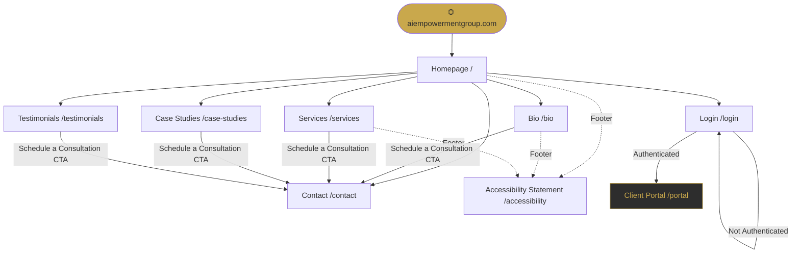
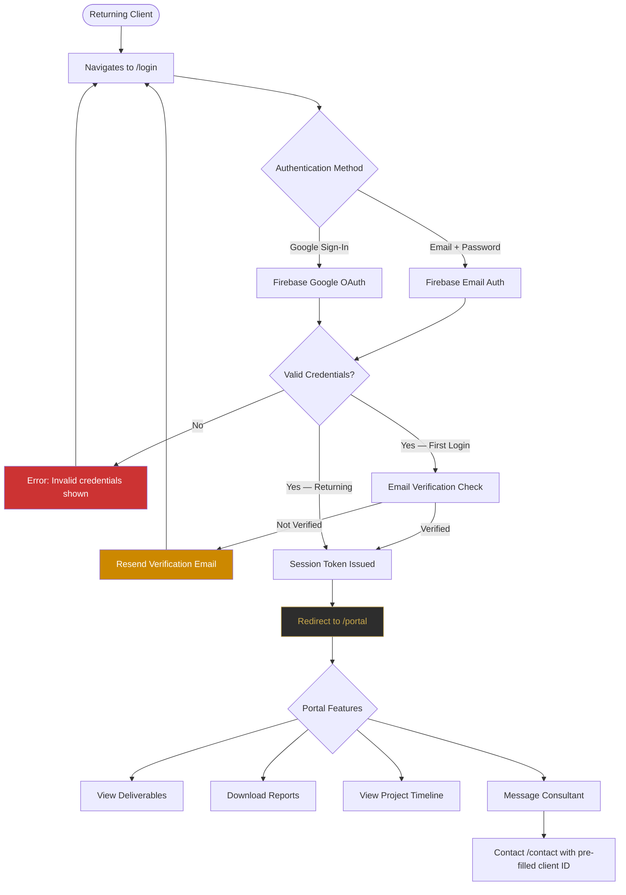
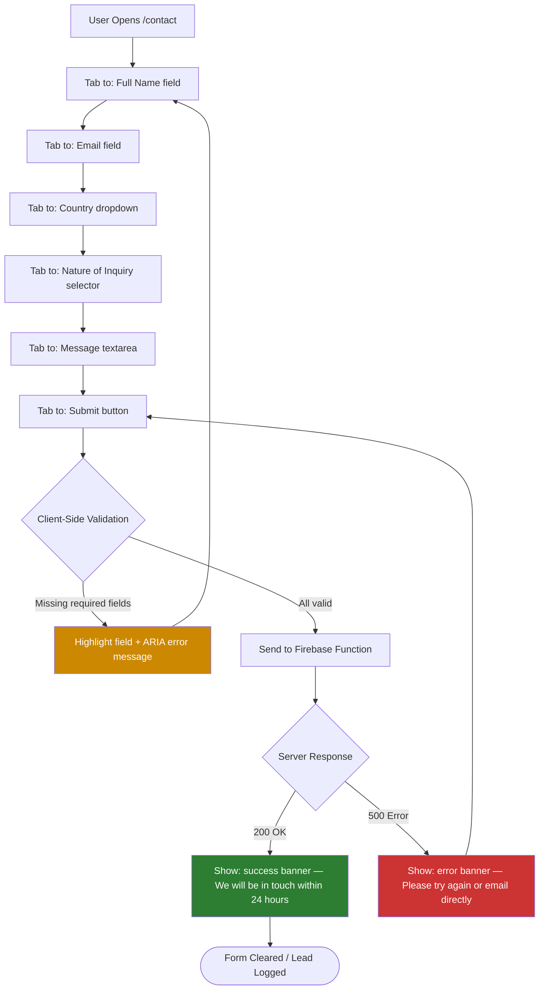
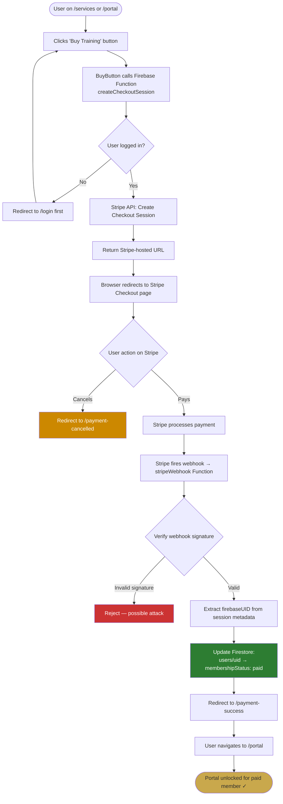
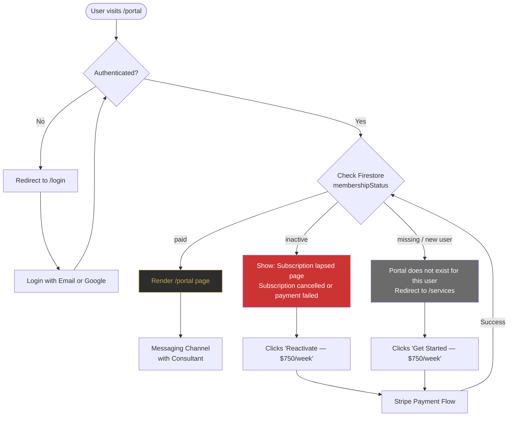
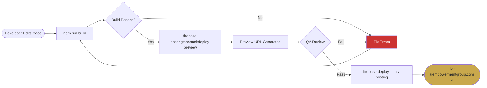

# AI Empowerment Group — Flow Diagrams

---

## 1. Site Navigation Flow

---

## 2. User Journey — New Visitor (Lead Conversion)

```mermaid
flowchart LR
    A([Visitor Lands]) --> B{Entry Point}

    B -->|Google Search| C[Homepage]
    B -->|LinkedIn / Referral| D[Bio Page]
    B -->|Direct Service Search| E[Services Page]

    C --> F[Reads Hero + Services Preview]
    F --> G[Clicks 'Learn More']
    G --> E

    D --> H[Reads Authority Bio]
    H --> I{Convinced?}
    I -->|Yes| G2[Clicks 'Work With Me']
    I -->|No| E

    E --> J[Reads Service Detail]
    J --> K[Views Case Studies]
    K --> L[Reads Testimonials]
    L --> M[Clicks 'Schedule a Consultation']
    G2 --> M

    M --> N[Contact Form /contact]
    N --> O[Fills: Name, Country, Inquiry Type, Message]
    O --> P{Form Valid?}
    P -->|Error| Q[Inline Error State Shown]
    Q --> O
    P -->|Success| R[Success Confirmation Message]
    R --> S([Lead Captured ✓])

    style S fill:#C9A84C,color:#2D2D2D
    style Q fill:#cc3333,color:#fff
```

---

## 3. User Journey — Returning Client (Login Flow — Phase 2)

---

## 4. Contact Form Logic Flow

---

## 6. Stripe Payment Flow

---

## 7. Membership Access Control

---

## 5. Firebase Deploy Pipeline

